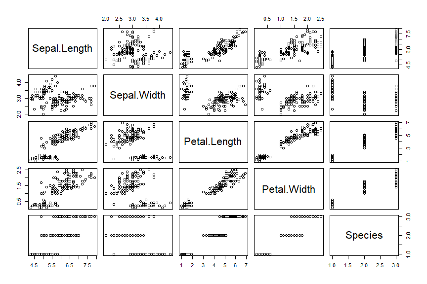

## Read and Write CSV


```r
library(readr)
```

```
## Warning: package 'readr' was built under R version 3.5.3
```

How to read csv file: read_csv untuk delimiter , dan read_csv2 untuk delimiter ;

```r
dc <- read_csv("../data-raw/evals.csv")
```

```
## Parsed with column specification:
## cols(
##   .default = col_double(),
##   rank = col_character(),
##   ethnicity = col_character(),
##   gender = col_character(),
##   language = col_character(),
##   cls_level = col_character(),
##   cls_profs = col_character(),
##   cls_credits = col_character(),
##   pic_outfit = col_character(),
##   pic_color = col_character()
## )
```

```
## See spec(...) for full column specifications.
```

```r
dc
```

```
## # A tibble: 463 x 21
##    score rank  ethnicity gender language   age cls_perc_eval cls_did_eval
##    <dbl> <chr> <chr>     <chr>  <chr>    <dbl>         <dbl>        <dbl>
##  1   4.7 tenu~ minority  female english     36          55.8           24
##  2   4.1 tenu~ minority  female english     36          68.8           86
##  3   3.9 tenu~ minority  female english     36          60.8           76
##  4   4.8 tenu~ minority  female english     36          62.6           77
##  5   4.6 tenu~ not mino~ male   english     59          85             17
##  6   4.3 tenu~ not mino~ male   english     59          87.5           35
##  7   2.8 tenu~ not mino~ male   english     59          88.6           39
##  8   4.1 tenu~ not mino~ male   english     51         100             55
##  9   3.4 tenu~ not mino~ male   english     51          56.9          111
## 10   4.5 tenu~ not mino~ female english     40          87.0           40
## # ... with 453 more rows, and 13 more variables: cls_students <dbl>,
## #   cls_level <chr>, cls_profs <chr>, cls_credits <chr>,
## #   bty_f1lower <dbl>, bty_f1upper <dbl>, bty_f2upper <dbl>,
## #   bty_m1lower <dbl>, bty_m1upper <dbl>, bty_m2upper <dbl>,
## #   bty_avg <dbl>, pic_outfit <chr>, pic_color <chr>
```

```r
dc2 <- read_csv2("../data-raw/evals2.csv")
```

```
## Using ',' as decimal and '.' as grouping mark. Use read_delim() for more control.
```

```
## Parsed with column specification:
## cols(
##   .default = col_double(),
##   rank = col_character(),
##   ethnicity = col_character(),
##   gender = col_character(),
##   language = col_character(),
##   cls_level = col_character(),
##   cls_profs = col_character(),
##   cls_credits = col_character(),
##   pic_outfit = col_character(),
##   pic_color = col_character()
## )
```

```
## See spec(...) for full column specifications.
```

```r
identical(dc, dc2) # fungsi untuk cek kesamaan antara dua obyek
```

```
## [1] TRUE
```
fungsi `glimpse` dari paket `dplyr`dan fungsi `skim()` dari paket `skimr` untuk melihat ringkasan data.

```r
library(dplyr)
```

```
## Warning: package 'dplyr' was built under R version 3.5.3
```

```
## 
## Attaching package: 'dplyr'
```

```
## The following objects are masked from 'package:stats':
## 
##     filter, lag
```

```
## The following objects are masked from 'package:base':
## 
##     intersect, setdiff, setequal, union
```

```r
glimpse(dc)
```

```
## Observations: 463
## Variables: 21
## $ score         <dbl> 4.7, 4.1, 3.9, 4.8, 4.6, 4.3, 2.8, 4.1, 3.4, 4.5...
## $ rank          <chr> "tenure track", "tenure track", "tenure track", ...
## $ ethnicity     <chr> "minority", "minority", "minority", "minority", ...
## $ gender        <chr> "female", "female", "female", "female", "male", ...
## $ language      <chr> "english", "english", "english", "english", "eng...
## $ age           <dbl> 36, 36, 36, 36, 59, 59, 59, 51, 51, 40, 40, 40, ...
## $ cls_perc_eval <dbl> 55.81395, 68.80000, 60.80000, 62.60163, 85.00000...
## $ cls_did_eval  <dbl> 24, 86, 76, 77, 17, 35, 39, 55, 111, 40, 24, 24,...
## $ cls_students  <dbl> 43, 125, 125, 123, 20, 40, 44, 55, 195, 46, 27, ...
## $ cls_level     <chr> "upper", "upper", "upper", "upper", "upper", "up...
## $ cls_profs     <chr> "single", "single", "single", "single", "multipl...
## $ cls_credits   <chr> "multi credit", "multi credit", "multi credit", ...
## $ bty_f1lower   <dbl> 5, 5, 5, 5, 4, 4, 4, 5, 5, 2, 2, 2, 2, 2, 2, 2, ...
## $ bty_f1upper   <dbl> 7, 7, 7, 7, 4, 4, 4, 2, 2, 5, 5, 5, 5, 5, 5, 5, ...
## $ bty_f2upper   <dbl> 6, 6, 6, 6, 2, 2, 2, 5, 5, 4, 4, 4, 4, 4, 4, 4, ...
## $ bty_m1lower   <dbl> 2, 2, 2, 2, 2, 2, 2, 2, 2, 3, 3, 3, 3, 3, 3, 3, ...
## $ bty_m1upper   <dbl> 4, 4, 4, 4, 3, 3, 3, 3, 3, 3, 3, 3, 3, 3, 3, 3, ...
## $ bty_m2upper   <dbl> 6, 6, 6, 6, 3, 3, 3, 3, 3, 2, 2, 2, 2, 2, 2, 2, ...
## $ bty_avg       <dbl> 5.000, 5.000, 5.000, 5.000, 3.000, 3.000, 3.000,...
## $ pic_outfit    <chr> "not formal", "not formal", "not formal", "not f...
## $ pic_color     <chr> "color", "color", "color", "color", "color", "co...
```

```r
library(skimr)
```

```
## Warning: package 'skimr' was built under R version 3.5.3
```

```
## 
## Attaching package: 'skimr'
```

```
## The following object is masked from 'package:stats':
## 
##     filter
```

```r
skim(dc)
```

```
## Skim summary statistics
##  n obs: 463 
##  n variables: 21 
## 
## -- Variable type:character -------------------------------------------------------------------------
##     variable missing complete   n min max empty n_unique
##  cls_credits       0      463 463  10  12     0        2
##    cls_level       0      463 463   5   5     0        2
##    cls_profs       0      463 463   6   8     0        2
##    ethnicity       0      463 463   8  12     0        2
##       gender       0      463 463   4   6     0        2
##     language       0      463 463   7  11     0        2
##    pic_color       0      463 463   5  11     0        2
##   pic_outfit       0      463 463   6  10     0        2
##         rank       0      463 463   7  12     0        3
## 
## -- Variable type:numeric ---------------------------------------------------------------------------
##       variable missing complete   n  mean    sd    p0   p25   p50   p75
##            age       0      463 463 48.37  9.8  29    42    48    57   
##        bty_avg       0      463 463  4.42  1.53  1.67  3.17  4.33  5.5 
##    bty_f1lower       0      463 463  3.96  1.87  1     2     4     5   
##    bty_f1upper       0      463 463  5.02  1.93  1     4     5     7   
##    bty_f2upper       0      463 463  5.21  2.02  1     4     5     6   
##    bty_m1lower       0      463 463  3.41  1.64  1     2     3     5   
##    bty_m1upper       0      463 463  4.15  2.11  1     3     4     5   
##    bty_m2upper       0      463 463  4.75  1.58  1     4     5     6   
##   cls_did_eval       0      463 463 36.62 45.02  5    15    23    40   
##  cls_perc_eval       0      463 463 74.43 16.76 10.42 62.7  76.92 87.25
##   cls_students       0      463 463 55.18 75.07  8    19    29    60   
##          score       0      463 463  4.17  0.54  2.3   3.8   4.3   4.6 
##    p100     hist
##   73    <U+2585><U+2585><U+2585><U+2587><U+2585><U+2587><U+2582><U+2581>
##    8.17 <U+2582><U+2585><U+2585><U+2587><U+2583><U+2583><U+2582><U+2581>
##    8    <U+2583><U+2587><U+2586><U+2587><U+2586><U+2585><U+2582><U+2582>
##    9    <U+2583><U+2586><U+2587><U+2585><U+2586><U+2586><U+2583><U+2581>
##   10    <U+2583><U+2583><U+2586><U+2587><U+2587><U+2582><U+2582><U+2583>
##    7    <U+2582><U+2587><U+2585><U+2585><U+2581><U+2583><U+2582><U+2581>
##    9    <U+2587><U+2587><U+2587><U+2585><U+2583><U+2582><U+2582><U+2581>
##    9    <U+2582><U+2583><U+2587><U+2586><U+2585><U+2582><U+2581><U+2581>
##  380    <U+2587><U+2581><U+2581><U+2581><U+2581><U+2581><U+2581><U+2581>
##  100    <U+2581><U+2581><U+2581><U+2582><U+2585><U+2586><U+2587><U+2586>
##  581    <U+2587><U+2581><U+2581><U+2581><U+2581><U+2581><U+2581><U+2581>
##    5    <U+2581><U+2581><U+2582><U+2583><U+2585><U+2587><U+2587><U+2586>
```


```r
plot(iris) # membuat plot
```

<!-- -->

```r
cor(iris[, -5]) # membuat matriks korelasi pada semua kolom berjenis numerik
```

```
##              Sepal.Length Sepal.Width Petal.Length Petal.Width
## Sepal.Length    1.0000000  -0.1175698    0.8717538   0.8179411
## Sepal.Width    -0.1175698   1.0000000   -0.4284401  -0.3661259
## Petal.Length    0.8717538  -0.4284401    1.0000000   0.9628654
## Petal.Width     0.8179411  -0.3661259    0.9628654   1.0000000
```

Save 

```r
write.csv(iris, file = "dc.csv", row.names = FALSE) # menyimpan iris menjadi berkas csv 
```


## Functions
Function:

```r
dc # mencetak data di konsol
```

```
## # A tibble: 463 x 21
##    score rank  ethnicity gender language   age cls_perc_eval cls_did_eval
##    <dbl> <chr> <chr>     <chr>  <chr>    <dbl>         <dbl>        <dbl>
##  1   4.7 tenu~ minority  female english     36          55.8           24
##  2   4.1 tenu~ minority  female english     36          68.8           86
##  3   3.9 tenu~ minority  female english     36          60.8           76
##  4   4.8 tenu~ minority  female english     36          62.6           77
##  5   4.6 tenu~ not mino~ male   english     59          85             17
##  6   4.3 tenu~ not mino~ male   english     59          87.5           35
##  7   2.8 tenu~ not mino~ male   english     59          88.6           39
##  8   4.1 tenu~ not mino~ male   english     51         100             55
##  9   3.4 tenu~ not mino~ male   english     51          56.9          111
## 10   4.5 tenu~ not mino~ female english     40          87.0           40
## # ... with 453 more rows, and 13 more variables: cls_students <dbl>,
## #   cls_level <chr>, cls_profs <chr>, cls_credits <chr>,
## #   bty_f1lower <dbl>, bty_f1upper <dbl>, bty_f2upper <dbl>,
## #   bty_m1lower <dbl>, bty_m1upper <dbl>, bty_m2upper <dbl>,
## #   bty_avg <dbl>, pic_outfit <chr>, pic_color <chr>
```

```r
dim(dc) # memberikan dimensi dari data. Angka pertama merupakan jumlah baris dan angka kedua adalah jumlah kolom
```

```
## [1] 463  21
```

```r
str(dc) # mencetak struktur dari data (jumlah baris, jumlah kolom, nama kolom, jenis data pada kolom)
```

```
## Classes 'spec_tbl_df', 'tbl_df', 'tbl' and 'data.frame':	463 obs. of  21 variables:
##  $ score        : num  4.7 4.1 3.9 4.8 4.6 4.3 2.8 4.1 3.4 4.5 ...
##  $ rank         : chr  "tenure track" "tenure track" "tenure track" "tenure track" ...
##  $ ethnicity    : chr  "minority" "minority" "minority" "minority" ...
##  $ gender       : chr  "female" "female" "female" "female" ...
##  $ language     : chr  "english" "english" "english" "english" ...
##  $ age          : num  36 36 36 36 59 59 59 51 51 40 ...
##  $ cls_perc_eval: num  55.8 68.8 60.8 62.6 85 ...
##  $ cls_did_eval : num  24 86 76 77 17 35 39 55 111 40 ...
##  $ cls_students : num  43 125 125 123 20 40 44 55 195 46 ...
##  $ cls_level    : chr  "upper" "upper" "upper" "upper" ...
##  $ cls_profs    : chr  "single" "single" "single" "single" ...
##  $ cls_credits  : chr  "multi credit" "multi credit" "multi credit" "multi credit" ...
##  $ bty_f1lower  : num  5 5 5 5 4 4 4 5 5 2 ...
##  $ bty_f1upper  : num  7 7 7 7 4 4 4 2 2 5 ...
##  $ bty_f2upper  : num  6 6 6 6 2 2 2 5 5 4 ...
##  $ bty_m1lower  : num  2 2 2 2 2 2 2 2 2 3 ...
##  $ bty_m1upper  : num  4 4 4 4 3 3 3 3 3 3 ...
##  $ bty_m2upper  : num  6 6 6 6 3 3 3 3 3 2 ...
##  $ bty_avg      : num  5 5 5 5 3 ...
##  $ pic_outfit   : chr  "not formal" "not formal" "not formal" "not formal" ...
##  $ pic_color    : chr  "color" "color" "color" "color" ...
##  - attr(*, "spec")=
##   .. cols(
##   ..   score = col_double(),
##   ..   rank = col_character(),
##   ..   ethnicity = col_character(),
##   ..   gender = col_character(),
##   ..   language = col_character(),
##   ..   age = col_double(),
##   ..   cls_perc_eval = col_double(),
##   ..   cls_did_eval = col_double(),
##   ..   cls_students = col_double(),
##   ..   cls_level = col_character(),
##   ..   cls_profs = col_character(),
##   ..   cls_credits = col_character(),
##   ..   bty_f1lower = col_double(),
##   ..   bty_f1upper = col_double(),
##   ..   bty_f2upper = col_double(),
##   ..   bty_m1lower = col_double(),
##   ..   bty_m1upper = col_double(),
##   ..   bty_m2upper = col_double(),
##   ..   bty_avg = col_double(),
##   ..   pic_outfit = col_character(),
##   ..   pic_color = col_character()
##   .. )
```

```r
colnames(dc) # mencetak nama dari setiap kolom
```

```
##  [1] "score"         "rank"          "ethnicity"     "gender"       
##  [5] "language"      "age"           "cls_perc_eval" "cls_did_eval" 
##  [9] "cls_students"  "cls_level"     "cls_profs"     "cls_credits"  
## [13] "bty_f1lower"   "bty_f1upper"   "bty_f2upper"   "bty_m1lower"  
## [17] "bty_m1upper"   "bty_m2upper"   "bty_avg"       "pic_outfit"   
## [21] "pic_color"
```

```r
head(dc) # mencetak 6 baris pertama pada data
```

```
## # A tibble: 6 x 21
##   score rank  ethnicity gender language   age cls_perc_eval cls_did_eval
##   <dbl> <chr> <chr>     <chr>  <chr>    <dbl>         <dbl>        <dbl>
## 1   4.7 tenu~ minority  female english     36          55.8           24
## 2   4.1 tenu~ minority  female english     36          68.8           86
## 3   3.9 tenu~ minority  female english     36          60.8           76
## 4   4.8 tenu~ minority  female english     36          62.6           77
## 5   4.6 tenu~ not mino~ male   english     59          85             17
## 6   4.3 tenu~ not mino~ male   english     59          87.5           35
## # ... with 13 more variables: cls_students <dbl>, cls_level <chr>,
## #   cls_profs <chr>, cls_credits <chr>, bty_f1lower <dbl>,
## #   bty_f1upper <dbl>, bty_f2upper <dbl>, bty_m1lower <dbl>,
## #   bty_m1upper <dbl>, bty_m2upper <dbl>, bty_avg <dbl>, pic_outfit <chr>,
## #   pic_color <chr>
```

```r
head(dc, 10) # mencetak 10 baris pertama pada data
```

```
## # A tibble: 10 x 21
##    score rank  ethnicity gender language   age cls_perc_eval cls_did_eval
##    <dbl> <chr> <chr>     <chr>  <chr>    <dbl>         <dbl>        <dbl>
##  1   4.7 tenu~ minority  female english     36          55.8           24
##  2   4.1 tenu~ minority  female english     36          68.8           86
##  3   3.9 tenu~ minority  female english     36          60.8           76
##  4   4.8 tenu~ minority  female english     36          62.6           77
##  5   4.6 tenu~ not mino~ male   english     59          85             17
##  6   4.3 tenu~ not mino~ male   english     59          87.5           35
##  7   2.8 tenu~ not mino~ male   english     59          88.6           39
##  8   4.1 tenu~ not mino~ male   english     51         100             55
##  9   3.4 tenu~ not mino~ male   english     51          56.9          111
## 10   4.5 tenu~ not mino~ female english     40          87.0           40
## # ... with 13 more variables: cls_students <dbl>, cls_level <chr>,
## #   cls_profs <chr>, cls_credits <chr>, bty_f1lower <dbl>,
## #   bty_f1upper <dbl>, bty_f2upper <dbl>, bty_m1lower <dbl>,
## #   bty_m1upper <dbl>, bty_m2upper <dbl>, bty_avg <dbl>, pic_outfit <chr>,
## #   pic_color <chr>
```

```r
tail(dc) # mencetak 6 baris terakhir pada data
```

```
## # A tibble: 6 x 21
##   score rank  ethnicity gender language   age cls_perc_eval cls_did_eval
##   <dbl> <chr> <chr>     <chr>  <chr>    <dbl>         <dbl>        <dbl>
## 1   4.1 tenu~ not mino~ male   english     32          42.9            9
## 2   4.5 tenu~ not mino~ male   english     32          60.5           52
## 3   3.5 tenu~ minority  female non-eng~    42          57.1           48
## 4   4.4 tenu~ minority  female non-eng~    42          77.6           52
## 5   4.4 tenu~ minority  female non-eng~    42          81.8           54
## 6   4.1 tenu~ minority  female non-eng~    42          80             28
## # ... with 13 more variables: cls_students <dbl>, cls_level <chr>,
## #   cls_profs <chr>, cls_credits <chr>, bty_f1lower <dbl>,
## #   bty_f1upper <dbl>, bty_f2upper <dbl>, bty_m1lower <dbl>,
## #   bty_m1upper <dbl>, bty_m2upper <dbl>, bty_avg <dbl>, pic_outfit <chr>,
## #   pic_color <chr>
```

```r
tail(dc, 10) # mencetak 10 baris terakhir pada data
```

```
## # A tibble: 10 x 21
##    score rank  ethnicity gender language   age cls_perc_eval cls_did_eval
##    <dbl> <chr> <chr>     <chr>  <chr>    <dbl>         <dbl>        <dbl>
##  1   4.5 tenu~ not mino~ male   english     32          74.2           98
##  2   4.5 tenu~ not mino~ male   english     32          87.4          111
##  3   4.5 tenu~ not mino~ male   english     32          72.9           62
##  4   4.6 tenu~ not mino~ male   english     32          75.2           76
##  5   4.1 tenu~ not mino~ male   english     32          42.9            9
##  6   4.5 tenu~ not mino~ male   english     32          60.5           52
##  7   3.5 tenu~ minority  female non-eng~    42          57.1           48
##  8   4.4 tenu~ minority  female non-eng~    42          77.6           52
##  9   4.4 tenu~ minority  female non-eng~    42          81.8           54
## 10   4.1 tenu~ minority  female non-eng~    42          80             28
## # ... with 13 more variables: cls_students <dbl>, cls_level <chr>,
## #   cls_profs <chr>, cls_credits <chr>, bty_f1lower <dbl>,
## #   bty_f1upper <dbl>, bty_f2upper <dbl>, bty_m1lower <dbl>,
## #   bty_m1upper <dbl>, bty_m2upper <dbl>, bty_avg <dbl>, pic_outfit <chr>,
## #   pic_color <chr>
```

```r
summary(dc) # mencetak rangkuman data
```

```
##      score           rank            ethnicity            gender         
##  Min.   :2.300   Length:463         Length:463         Length:463        
##  1st Qu.:3.800   Class :character   Class :character   Class :character  
##  Median :4.300   Mode  :character   Mode  :character   Mode  :character  
##  Mean   :4.175                                                           
##  3rd Qu.:4.600                                                           
##  Max.   :5.000                                                           
##    language              age        cls_perc_eval     cls_did_eval   
##  Length:463         Min.   :29.00   Min.   : 10.42   Min.   :  5.00  
##  Class :character   1st Qu.:42.00   1st Qu.: 62.70   1st Qu.: 15.00  
##  Mode  :character   Median :48.00   Median : 76.92   Median : 23.00  
##                     Mean   :48.37   Mean   : 74.43   Mean   : 36.62  
##                     3rd Qu.:57.00   3rd Qu.: 87.25   3rd Qu.: 40.00  
##                     Max.   :73.00   Max.   :100.00   Max.   :380.00  
##   cls_students     cls_level          cls_profs         cls_credits       
##  Min.   :  8.00   Length:463         Length:463         Length:463        
##  1st Qu.: 19.00   Class :character   Class :character   Class :character  
##  Median : 29.00   Mode  :character   Mode  :character   Mode  :character  
##  Mean   : 55.18                                                           
##  3rd Qu.: 60.00                                                           
##  Max.   :581.00                                                           
##   bty_f1lower     bty_f1upper     bty_f2upper      bty_m1lower   
##  Min.   :1.000   Min.   :1.000   Min.   : 1.000   Min.   :1.000  
##  1st Qu.:2.000   1st Qu.:4.000   1st Qu.: 4.000   1st Qu.:2.000  
##  Median :4.000   Median :5.000   Median : 5.000   Median :3.000  
##  Mean   :3.963   Mean   :5.019   Mean   : 5.214   Mean   :3.413  
##  3rd Qu.:5.000   3rd Qu.:7.000   3rd Qu.: 6.000   3rd Qu.:5.000  
##  Max.   :8.000   Max.   :9.000   Max.   :10.000   Max.   :7.000  
##   bty_m1upper     bty_m2upper       bty_avg       pic_outfit       
##  Min.   :1.000   Min.   :1.000   Min.   :1.667   Length:463        
##  1st Qu.:3.000   1st Qu.:4.000   1st Qu.:3.167   Class :character  
##  Median :4.000   Median :5.000   Median :4.333   Mode  :character  
##  Mean   :4.147   Mean   :4.752   Mean   :4.418                     
##  3rd Qu.:5.000   3rd Qu.:6.000   3rd Qu.:5.500                     
##  Max.   :9.000   Max.   :9.000   Max.   :8.167                     
##   pic_color        
##  Length:463        
##  Class :character  
##  Mode  :character  
##                    
##                    
## 
```

```r
dc[1, ] # subset data pada baris 1
```

```
## # A tibble: 1 x 21
##   score rank  ethnicity gender language   age cls_perc_eval cls_did_eval
##   <dbl> <chr> <chr>     <chr>  <chr>    <dbl>         <dbl>        <dbl>
## 1   4.7 tenu~ minority  female english     36          55.8           24
## # ... with 13 more variables: cls_students <dbl>, cls_level <chr>,
## #   cls_profs <chr>, cls_credits <chr>, bty_f1lower <dbl>,
## #   bty_f1upper <dbl>, bty_f2upper <dbl>, bty_m1lower <dbl>,
## #   bty_m1upper <dbl>, bty_m2upper <dbl>, bty_avg <dbl>, pic_outfit <chr>,
## #   pic_color <chr>
```

```r
dc[c(1, 6, 12),] # subset data pada baris 1, 6, dan 12
```

```
## # A tibble: 3 x 21
##   score rank  ethnicity gender language   age cls_perc_eval cls_did_eval
##   <dbl> <chr> <chr>     <chr>  <chr>    <dbl>         <dbl>        <dbl>
## 1   4.7 tenu~ minority  female english     36          55.8           24
## 2   4.3 tenu~ not mino~ male   english     59          87.5           35
## 3   4.5 tenu~ not mino~ female english     40          96             24
## # ... with 13 more variables: cls_students <dbl>, cls_level <chr>,
## #   cls_profs <chr>, cls_credits <chr>, bty_f1lower <dbl>,
## #   bty_f1upper <dbl>, bty_f2upper <dbl>, bty_m1lower <dbl>,
## #   bty_m1upper <dbl>, bty_m2upper <dbl>, bty_avg <dbl>, pic_outfit <chr>,
## #   pic_color <chr>
```

```r
dc[ ,2] # subset atau ekstrak data pada kolom 2
```

```
## # A tibble: 463 x 1
##    rank        
##    <chr>       
##  1 tenure track
##  2 tenure track
##  3 tenure track
##  4 tenure track
##  5 tenured     
##  6 tenured     
##  7 tenured     
##  8 tenured     
##  9 tenured     
## 10 tenured     
## # ... with 453 more rows
```

```r
dc[2,2] # ekstrak nilai pada baris 2 dan kolom 2
```

```
## # A tibble: 1 x 1
##   rank        
##   <chr>       
## 1 tenure track
```

```r
dc$gender# ekstrak data pada kolom
```

```
##   [1] "female" "female" "female" "female" "male"   "male"   "male"  
##   [8] "male"   "male"   "female" "female" "female" "female" "female"
##  [15] "female" "female" "female" "female" "female" "female" "female"
##  [22] "female" "female" "male"   "male"   "male"   "male"   "male"  
##  [29] "male"   "male"   "female" "female" "female" "female" "female"
##  [36] "female" "female" "female" "female" "female" "female" "female"
##  [43] "female" "female" "female" "female" "female" "female" "female"
##  [50] "male"   "male"   "male"   "male"   "male"   "male"   "male"  
##  [57] "male"   "male"   "male"   "male"   "male"   "male"   "male"  
##  [64] "male"   "male"   "male"   "male"   "male"   "male"   "male"  
##  [71] "male"   "male"   "male"   "male"   "male"   "male"   "male"  
##  [78] "male"   "female" "female" "female" "female" "male"   "male"  
##  [85] "male"   "male"   "male"   "male"   "female" "female" "female"
##  [92] "female" "female" "male"   "male"   "male"   "male"   "male"  
##  [99] "male"   "male"   "male"   "female" "female" "female" "female"
## [106] "female" "female" "female" "female" "female" "female" "female"
## [113] "female" "female" "female" "female" "female" "female" "female"
## [120] "female" "female" "female" "female" "female" "female" "female"
## [127] "female" "male"   "male"   "male"   "male"   "male"   "male"  
## [134] "male"   "male"   "male"   "male"   "male"   "male"   "female"
## [141] "female" "male"   "male"   "male"   "male"   "male"   "male"  
## [148] "male"   "male"   "male"   "male"   "male"   "male"   "male"  
## [155] "male"   "male"   "male"   "male"   "male"   "male"   "male"  
## [162] "female" "male"   "male"   "male"   "male"   "male"   "male"  
## [169] "male"   "male"   "male"   "male"   "male"   "male"   "male"  
## [176] "male"   "male"   "female" "female" "female" "female" "female"
## [183] "female" "female" "female" "female" "female" "female" "female"
## [190] "female" "male"   "male"   "male"   "female" "female" "female"
## [197] "female" "male"   "male"   "male"   "male"   "male"   "male"  
## [204] "male"   "male"   "male"   "male"   "male"   "male"   "male"  
## [211] "male"   "male"   "male"   "male"   "male"   "male"   "male"  
## [218] "male"   "male"   "male"   "male"   "male"   "male"   "male"  
## [225] "male"   "male"   "female" "female" "female" "female" "male"  
## [232] "male"   "male"   "male"   "male"   "male"   "male"   "male"  
## [239] "male"   "male"   "female" "female" "female" "female" "female"
## [246] "female" "female" "female" "female" "female" "female" "male"  
## [253] "male"   "male"   "male"   "male"   "male"   "male"   "male"  
## [260] "male"   "male"   "male"   "male"   "male"   "female" "female"
## [267] "female" "female" "female" "female" "male"   "male"   "male"  
## [274] "male"   "female" "female" "female" "female" "female" "female"
## [281] "female" "female" "female" "female" "female" "female" "female"
## [288] "male"   "male"   "male"   "male"   "male"   "male"   "male"  
## [295] "male"   "female" "female" "female" "female" "female" "female"
## [302] "female" "female" "female" "female" "female" "female" "male"  
## [309] "male"   "female" "female" "female" "male"   "male"   "female"
## [316] "female" "female" "female" "female" "female" "female" "female"
## [323] "female" "female" "female" "female" "male"   "male"   "male"  
## [330] "male"   "male"   "male"   "male"   "male"   "male"   "male"  
## [337] "male"   "female" "male"   "male"   "male"   "male"   "male"  
## [344] "male"   "male"   "male"   "male"   "male"   "male"   "male"  
## [351] "male"   "male"   "male"   "male"   "male"   "male"   "male"  
## [358] "male"   "male"   "male"   "male"   "male"   "male"   "male"  
## [365] "male"   "male"   "male"   "male"   "male"   "male"   "male"  
## [372] "male"   "female" "female" "female" "female" "female" "female"
## [379] "female" "female" "female" "female" "male"   "male"   "male"  
## [386] "male"   "male"   "male"   "male"   "female" "female" "female"
## [393] "female" "male"   "male"   "male"   "male"   "male"   "male"  
## [400] "male"   "male"   "male"   "male"   "male"   "male"   "male"  
## [407] "male"   "male"   "female" "female" "female" "female" "female"
## [414] "female" "female" "female" "female" "female" "male"   "male"  
## [421] "male"   "male"   "male"   "male"   "male"   "male"   "male"  
## [428] "male"   "male"   "male"   "male"   "male"   "male"   "male"  
## [435] "male"   "male"   "male"   "male"   "female" "female" "female"
## [442] "male"   "male"   "female" "female" "female" "female" "female"
## [449] "female" "female" "female" "female" "female" "male"   "male"  
## [456] "male"   "male"   "male"   "male"   "female" "female" "female"
## [463] "female"
```

```r
class(dc$gender) # mengetahui jenis data dari suatu vektor
```

```
## [1] "character"
```

```r
length(dc$gender) # mengetahui jumlah data pada suatu vektor
```

```
## [1] 463
```

```r
levels(dc$gender) # mengetahui level dari kolom berjenis faktor
```

```
## NULL
```

```r
length(levels(dc$gender)) # mengetahui jumlah level dari kolom berjenis faktor
```

```
## [1] 0
```

```r
unique(dc$gender) # mengetahui nilai unik dari kolom berjenis karakter atau faktor
```

```
## [1] "female" "male"
```

```r
length(unique(dc$gender)) # mengetahui jumlah nilai unik dari kolom berjenis karakter atau faktor
```

```
## [1] 2
```

```r
mean(dc$age) # menghitung rerata
```

```
## [1] 48.36501
```

```r
sd(dc$age) # menghitung standar deviasi
```

```
## [1] 9.802742
```

```r
median(dc$age) # menghitung median
```

```
## [1] 48
```

```r
sum(dc$age) # menghitung jumlah total
```

```
## [1] 22393
```

## Struktur data

```r
c(1, 2, 3, 4)
```

```
## [1] 1 2 3 4
```

```r
c("r", "academy", "telkom", "university")
```

```
## [1] "r"          "academy"    "telkom"     "university"
```

```r
list(15, "r", "TRUE", 24L)
```

```
## [[1]]
## [1] 15
## 
## [[2]]
## [1] "r"
## 
## [[3]]
## [1] "TRUE"
## 
## [[4]]
## [1] 24
```

```r
huruf_vokal <- c("a", "i", "u", "e", "o") # objek data tersimpan dengan nama 'huruf_vokal', namun tidak tercetak pada konsol
huruf_vokal # mencetak objek data dengan nama 'huruf_vokal' pada konsol
```

```
## [1] "a" "i" "u" "e" "o"
```

Jenis dari data dapat diketahui dengan menggunakan fungsi `typeof()`. Dapatkah Anda mengetahui jenis data dari 'huruf_vokal' diatas? Bagaimana jika Anda membuat objek data dengan menggunakan fungsi `c()` namun jenis elemennya berbeda-beda?


```r
c(huruf_vokal)
```

```
## [1] "a" "i" "u" "e" "o"
```

```r
beragam <- c(2.7, "berbeda", TRUE, 4L) # 2.7 bertipe double, "berbeda" bertipe character, TRUE bertipe logical, 4L bertipe integer
typeof(c) # cek tipe dari objek data dengan nama 'beragam'
```

```
## [1] "builtin"
```

## Transformasi Data

```r
library(tidyr)
```

```
## Warning: package 'tidyr' was built under R version 3.5.3
```

```r
dc
```

```
## # A tibble: 463 x 21
##    score rank  ethnicity gender language   age cls_perc_eval cls_did_eval
##    <dbl> <chr> <chr>     <chr>  <chr>    <dbl>         <dbl>        <dbl>
##  1   4.7 tenu~ minority  female english     36          55.8           24
##  2   4.1 tenu~ minority  female english     36          68.8           86
##  3   3.9 tenu~ minority  female english     36          60.8           76
##  4   4.8 tenu~ minority  female english     36          62.6           77
##  5   4.6 tenu~ not mino~ male   english     59          85             17
##  6   4.3 tenu~ not mino~ male   english     59          87.5           35
##  7   2.8 tenu~ not mino~ male   english     59          88.6           39
##  8   4.1 tenu~ not mino~ male   english     51         100             55
##  9   3.4 tenu~ not mino~ male   english     51          56.9          111
## 10   4.5 tenu~ not mino~ female english     40          87.0           40
## # ... with 453 more rows, and 13 more variables: cls_students <dbl>,
## #   cls_level <chr>, cls_profs <chr>, cls_credits <chr>,
## #   bty_f1lower <dbl>, bty_f1upper <dbl>, bty_f2upper <dbl>,
## #   bty_m1lower <dbl>, bty_m1upper <dbl>, bty_m2upper <dbl>,
## #   bty_avg <dbl>, pic_outfit <chr>, pic_color <chr>
```

```r
tb <- dc%>%
      select(gender,age)

tb
```

```
## # A tibble: 463 x 2
##    gender   age
##    <chr>  <dbl>
##  1 female    36
##  2 female    36
##  3 female    36
##  4 female    36
##  5 male      59
##  6 male      59
##  7 male      59
##  8 male      51
##  9 male      51
## 10 female    40
## # ... with 453 more rows
```


